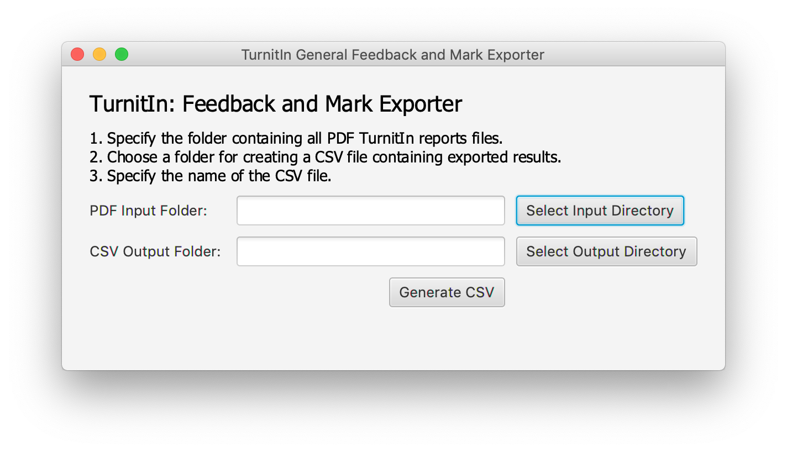

# TurnitInPDF2CSV: Export TurnitIn Report Data to CSV 
This software allows users to perform a bulk export of data from a list of TurnitIn Feedback Studio generated reports. 
TurnitIn API does not support downloading comments added to student submission using TurnitIn's Feedback Studio. The released JAR file provides a GUI interface for exporting:
* Submission Paper ID
* Full Name
* Grade
* General Comment
## How to use it?
1. Download the [released JAR file](https://github.com/kstepanyan/TurnitInPDF2CSV/releases/download/v0.1/TurnitInPDF2CSV.jar) to the desired folder on your machine.
1. Open the command line terminal.
1. Navigate to the folder with the downloaded JAR file. 
        ```sh
        cd your_folder_path
        ```
1. Check whether the downloaded file is in the current folder.
        for MacOS type in
        ```sh
        ls
        ```
        for Windows type in
        ```sh
        dir
        ```
1. Run the downloaded JAR file
        ```sh
        java -jar TurnitInPDF2CSV.jar
        ```
1. You should see a screen with a directory chooser, asking user to select an input and output directories (see below).
          
1. Click on *Select Input Directory* button to select the folder that contains all PDF TurnitIn Reports that need to be processed.
1. Click on *Select Output Directory* button to select the folder which will contain the CSV containing extracted data. 
1. Click *Generate CSV*
1. The 
        ```
        TurnitInFeedback.csv
        ```
will be added to the selected output folder.
*the terminal window will pring all text from the PDF reports and print the resulting extraction data in the end*
          
## Dependencies
Java Runtime Environment 8.0 and above. 
The released JAR comes embedded with the following libraries:
* ```pdf-box-2.0.19```
* ```opencsv-5.2```
* ```poi-4.1.2```
